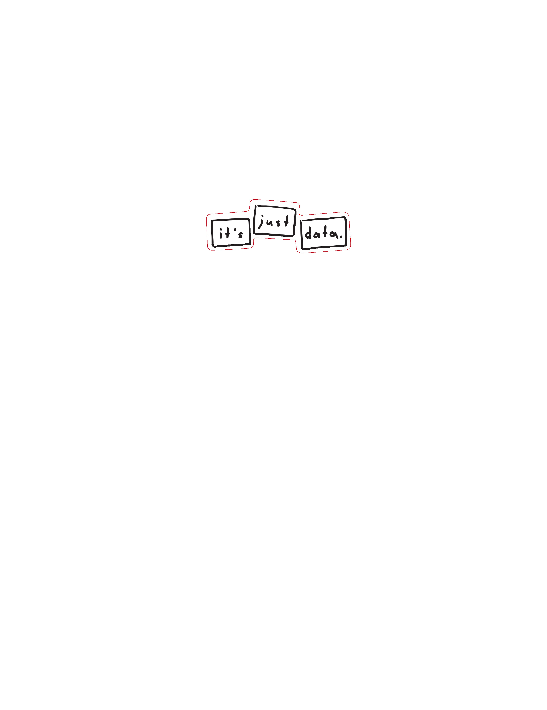

# What is Clojure?

- LISP

{width=150}

- Rich Hickey

{width=150}

- General Purpose

# What is LISP?

# What is LISP?

- LISt Processing language
- 2nd oldest High-Level Language after FORTRAN
- 1958 - John McCarthy

# Why Clojure?

- Designed with simplicity
- Functional Programming
- Data Oriented

