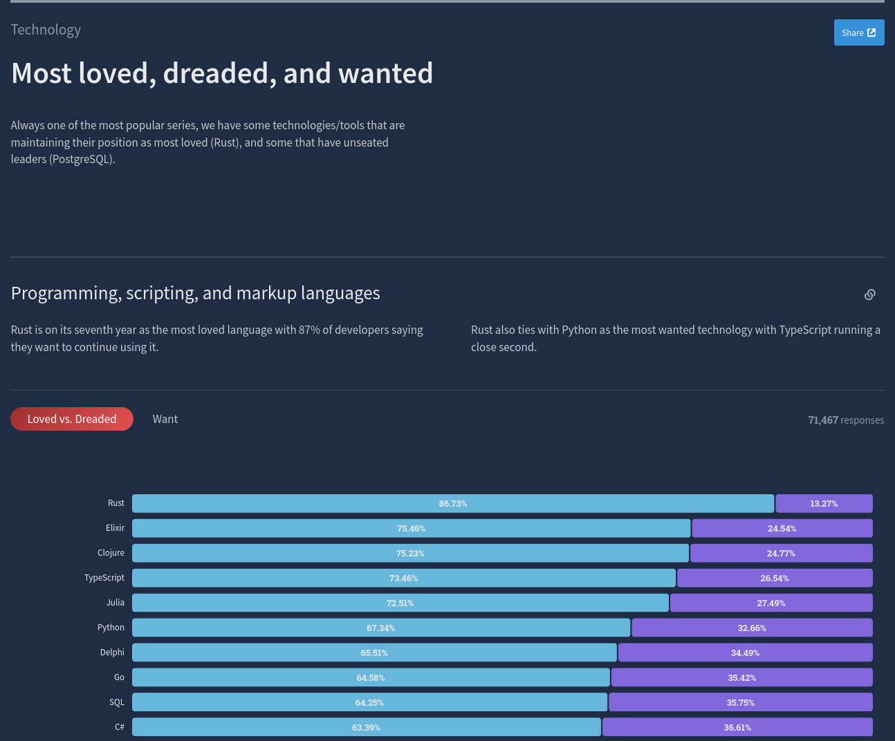

# What is Clojure?

- LISP

{width=150}

- Rich Hickey

{width=150}

- General Purpose

# What is LISP?

# What is LISP?

- LISt Processing language
- 2nd oldest High-Level Language after FORTRAN
- 1958 - John McCarthy

# Why Clojure?

- Designed with simplicity
- Functional Programming
- Data Oriented

{width=360}

# Why Clojure?

{height=240}

**Source:**
[https://survey.stackoverflow.co/2023/#section-top-paying-technologies-top-paying-technologies](https://survey.stackoverflow.co/2023/#section-top-paying-technologies-top-paying-technologies)

# Why Clojure?

{height=240}

**Source:**
[https://survey.stackoverflow.co/2022/#technology-most-loved-dreaded-and-wanted](https://survey.stackoverflow.co/2022/#technology-most-loved-dreaded-and-wanted)

# Functional Programming

- Immutability
- Referential transparency
- Easy to think about systems
- Parallel and concurrent programming

# Where to go from here?

{height=270}

# Functional Programmers Community

{height=270}
